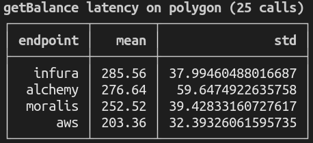

# Benchmarks to test the latency of different node providers

## To do first
1. fill in `.env` with your endpoints and mnemonic (copy `.env.example`)
2. fill in `providers.ts` with your endpoints (copy `providers.example.ts`)
## Benchmarks

1. getBalance
```
npx hardhat getBalanceBenchmark --network polygon
```


2. pga (WIP)
```
npx hardhat pgaBenchmark --network polygon
```